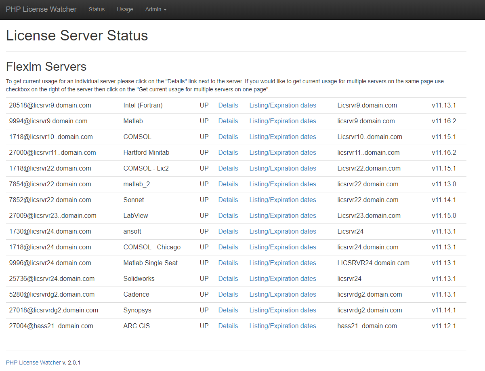

<!--
Nota bene : ce README est automatiquement généré par <https://github.com/YunoHost/apps/tree/master/tools/readme_generator>
Il NE doit PAS être modifié à la main.
-->

# PHPLicenseWatcher pour YunoHost

[](https://dash.yunohost.org/appci/app/phplicensewatcher)  

[](https://install-app.yunohost.org/?app=phplicensewatcher)

*[Lire le README dans d'autres langues.](./ALL_README.md)*

> *Ce package vous permet d’installer PHPLicenseWatcher rapidement et simplement sur un serveur YunoHost.*  
> *Si vous n’avez pas YunoHost, consultez [ce guide](https://yunohost.org/install) pour savoir comment l’installer et en profiter.*

## Vue d’ensemble

phpLicenseWatcher est une interface Web simple aux commandes FlexLM lmstat et lmdiag qui donne des informations sur l'état des serveurs FlexLM. Vous pouvez également obtenir des informations sur les fonctionnalités et le nombre de licences disponibles sur un serveur particulier.

### Caractéristiques

- Affiche la santé d'un serveur de licences ou d'un groupe d'entre eux
- Vérifiez quelles licences sont utilisées et qui les utilise actuellement
- Obtenez une liste des licences, leurs jours d'expiration et le nombre de jours avant l'expiration
- Alerte par e-mail des licences qui expireront dans un certain délai, c'est-à-dire. dans les 10 prochains jours.
- Surveille l'utilisation du serveur
- Fournit des tableaux d'utilisation 


**Version incluse :** 2024.04.26~ynh1

## Captures d’écran



## Documentations et ressources

- Site officiel de l’app : <http://phplicensewatch.sourceforge.net>
- Documentation officielle de l’admin : <https://phplicensewatch.sourceforge.io/index.html#Documentation>
- Dépôt de code officiel de l’app : <https://github.com/rpi-dotcio/phpLicenseWatcher>
- YunoHost Store : <https://apps.yunohost.org/app/phplicensewatcher>
- Signaler un bug : <https://github.com/YunoHost-Apps/phplicensewatcher_ynh/issues>

## Informations pour les développeurs

Merci de faire vos pull request sur la [branche `testing`](https://github.com/YunoHost-Apps/phplicensewatcher_ynh/tree/testing).

Pour essayer la branche `testing`, procédez comme suit :

```bash
sudo yunohost app install https://github.com/YunoHost-Apps/phplicensewatcher_ynh/tree/testing --debug
ou
sudo yunohost app upgrade phplicensewatcher -u https://github.com/YunoHost-Apps/phplicensewatcher_ynh/tree/testing --debug
```

**Plus d’infos sur le packaging d’applications :** <https://yunohost.org/packaging_apps>
