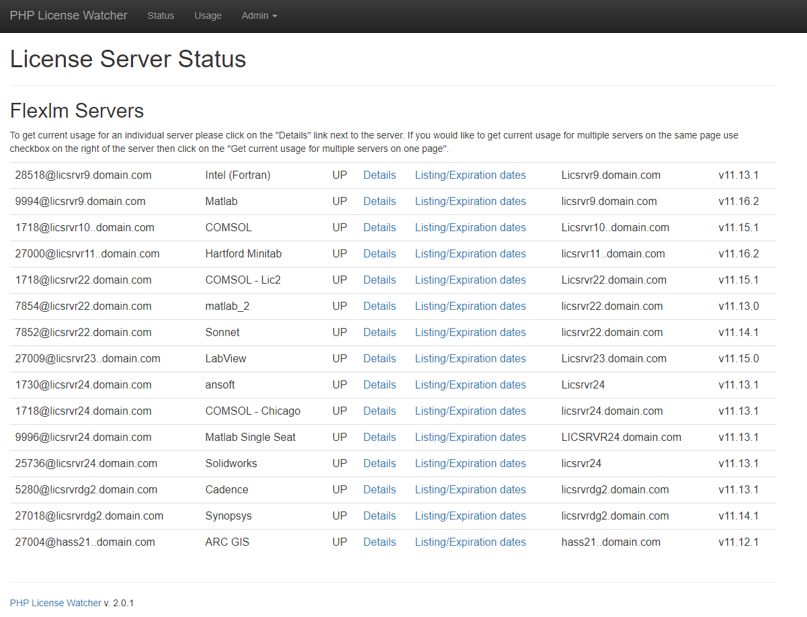

<!--
Важно: этот README был автоматически сгенерирован <https://github.com/YunoHost/apps/tree/master/tools/readme_generator>
Он НЕ ДОЛЖЕН редактироваться вручную.
-->

# PHPLicenseWatcher для YunoHost

[](https://ci-apps.yunohost.org/ci/apps/phplicensewatcher/)


[](https://install-app.yunohost.org/?app=phplicensewatcher)

*[Прочтите этот README на других языках.](./ALL_README.md)*

> *Этот пакет позволяет Вам установить PHPLicenseWatcher быстро и просто на YunoHost-сервер.*  
> *Если у Вас нет YunoHost, пожалуйста, посмотрите [инструкцию](https://yunohost.org/install), чтобы узнать, как установить его.*

## Обзор

phpLicenseWatcher is a simple Web frontend to the FlexLM lmstat and lmdiag commands that gives information about the status of FlexLM servers. You can also get information about features and number of licenses available on a particular server.

### Features

- Shows the health of a license server or a group of them
- Check which licenses are being used and who is currently using them
- Get a listing of licenses, their expiration days and number of days to expiration
- E-mail alert of licenses that will expire within certain time period ie. within next 10 days.
- Monitors server utilization
- Provides usage charts


**Поставляемая версия:** 2025.03.15~ynh1

## Снимки экрана



## Документация и ресурсы

- Официальный веб-сайт приложения: <http://phplicensewatch.sourceforge.net>
- Официальная документация администратора: <https://phplicensewatch.sourceforge.io/index.html#Documentation>
- Репозиторий кода главной ветки приложения: <https://github.com/rpi-dotcio/phpLicenseWatcher>
- Магазин YunoHost: <https://apps.yunohost.org/app/phplicensewatcher>
- Сообщите об ошибке: <https://github.com/YunoHost-Apps/phplicensewatcher_ynh/issues>

## Информация для разработчиков

Пришлите Ваш запрос на слияние в [ветку `testing`](https://github.com/YunoHost-Apps/phplicensewatcher_ynh/tree/testing).

Чтобы попробовать ветку `testing`, пожалуйста, сделайте что-то вроде этого:

```bash
sudo yunohost app install https://github.com/YunoHost-Apps/phplicensewatcher_ynh/tree/testing --debug
или
sudo yunohost app upgrade phplicensewatcher -u https://github.com/YunoHost-Apps/phplicensewatcher_ynh/tree/testing --debug
```

**Больше информации о пакетировании приложений:** <https://yunohost.org/packaging_apps>
